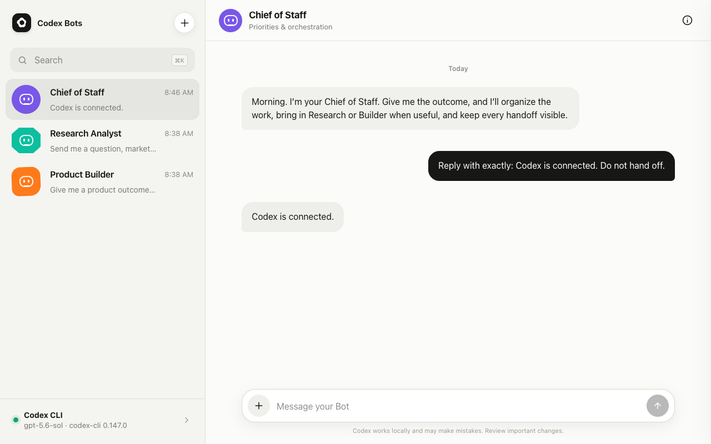

# Codex Bots

A local, open-source AI teammate interface powered by your existing Codex CLI login.

Codex Bots turns durable Codex threads into named teammates with one clear job. There are no model pickers or disposable topic threads in the main interface: choose a Bot, send it work, and continue the same relationship over time.



## What it includes

- A high-fidelity two-pane teammate UI inspired by the interaction model popularized by Grok Bot
- Three useful Bots on first launch:
  - **Chief of Staff** for priorities, decisions, and orchestration
  - **Research Analyst** for evidence-backed research and market intelligence
  - **Product Builder** for implementation, testing, and reviewable artifacts
- One persistent Codex SDK thread per Bot
- Visible asynchronous Bot-to-Bot handoffs
- A shared local `workspace/` where Bots can create and review files
- File attachments, custom Bot creation, search, responsive mobile layout, and stop controls
- SQLite conversation persistence stored only on the local machine
- GPT-5.6 Sol by default, configurable with `CODEX_BOT_MODEL`

## Why this exists

The useful idea behind Grok Bot is the abstraction: a durable agent becomes “your teammate whose job is X.” Codex already provides the intelligence, tools, sandboxing, authentication, and persistent threads. This project supplies the simpler teammate interface around the official Codex SDK.

Codex Bots is independent software. It is not affiliated with, endorsed by, or distributed by xAI, Grok, or OpenAI.

## Why these three Bots

Chief-of-staff coordination, research, and building/creation were the most repeated jobs across the Grok Bot launch material and early public demos reviewed for this project. There is not yet a trustworthy public usage ranking, so these are practical launch-pattern choices rather than a claim about measured market share. Together they also form a useful team: one Bot coordinates, one establishes evidence, and one produces artifacts.

## Requirements

- Python 3.10 or newer
- [Codex CLI](https://developers.openai.com/codex) installed and authenticated
- A ChatGPT plan or API setup that provides Codex access

Confirm Codex is ready:

```bash
codex --version
codex login
```

## Start on macOS

Double-click `start.command`, or run:

```bash
./start.command
```

If macOS blocks the first double-click, Control-click the file, choose **Open**, then confirm.

## Start on Linux

```bash
chmod +x start.sh
./start.sh
```

## Start on Windows

Double-click `start.bat` or run it from Command Prompt. The launcher creates `.venv`, installs the Python dependencies, opens the browser, and starts Flask on `http://127.0.0.1:5055`.

## Manual setup

```bash
python3 -m venv .venv
source .venv/bin/activate          # Windows: .venv\Scripts\activate
pip install -r requirements.txt
python app.py
```

## Configuration

Environment variables:

| Variable | Default | Purpose |
| --- | --- | --- |
| `CODEX_BOT_MODEL` | `gpt-5.6-sol` | Codex model used for new turns |
| `CODEX_BIN` | Codex found in `PATH` | Use a specific Codex CLI executable |
| `CODEX_BOTS_PORT` | `5055` | Local Flask port |
| `CODEX_BOTS_HOST` | `127.0.0.1` | Bind address |
| `CODEX_BOTS_OPEN_BROWSER` | `0` | Open the UI after startup when set to `1` |

The included launchers set `CODEX_BOTS_OPEN_BROWSER=1`.

## How it works

The Flask backend uses the official [`openai-codex`](https://learn.chatgpt.com/docs/codex-sdk) Python SDK. The SDK controls the user's installed Codex runtime through the local app-server protocol and reuses the Codex CLI authentication already present on the machine.

Each Bot stores its Codex thread ID in `instance/codex_bots.sqlite3`. Later messages resume that same thread. Bots run with the `workspace-write` sandbox rooted at this project's `workspace/` directory and automatic approval review.

When a Bot requests a teammate:

1. The handoff appears in the source conversation.
2. The destination Bot receives a focused assignment in its own durable thread.
3. It works independently.
4. Its result appears in both conversations.

Handoff depth is bounded to prevent runaway delegation.

## Local data and safety

- Conversation metadata is stored in `instance/`, which is ignored by Git.
- Bot artifacts and uploaded files are stored in `workspace/`, also ignored by Git.
- The app never asks for or stores an OpenAI API key.
- Codex still uses the permissions, MCP servers, rules, and authentication configured for the local user.
- Bots run with workspace-scoped write access by default, not full filesystem access.
- Always review important edits and external actions. An AI agent can still misunderstand a request.

Do not expose this development server directly to the internet. It has no multi-user authentication and is designed for one trusted user on localhost.

## Development

Run the tests:

```bash
.venv/bin/python -m unittest discover -s tests -v
```

Run a syntax check:

```bash
.venv/bin/python -m compileall app.py codex_bots tests
```

Pull requests run the same checks on Python 3.10 and the current Python release through GitHub Actions. Please report security concerns using the instructions in [SECURITY.md](SECURITY.md).

## Project status

This is a local-first beta. Browser/computer viewing and scheduled routines are intentionally excluded from the first public version because those features require an always-on or cloud execution layer. The architecture keeps those surfaces separable for a later release.

## License

[MIT](LICENSE)
